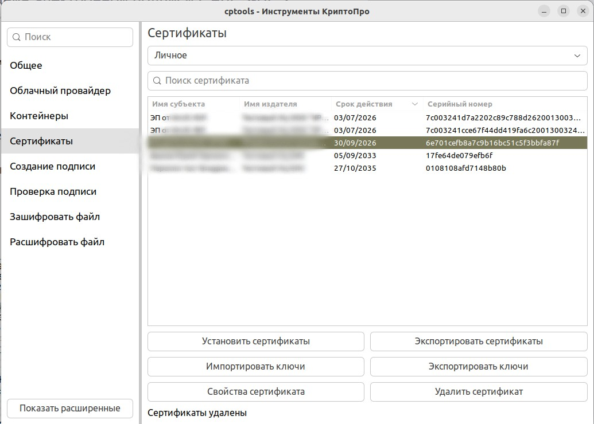
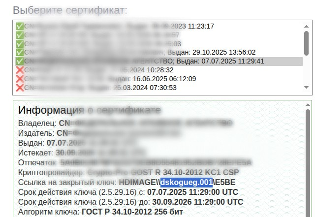
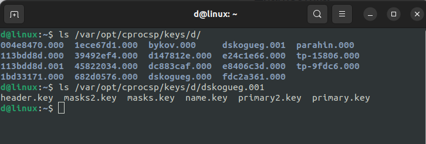

# Ключи и сертификаты: где взять контейнер, как извлечь ключи

Контейнер это `pfx` файл, добавляемый в КриптоПро. В Linux-системах после добавления это папка вида `xxxxxxxx.000` (бывает `.001`, `.002` и т.д.) с файлами:

```
header.key   primary.key    masks.key
name.key     primary2.key   masks2.key
```

Для конвертации в PEM нам нужны 3 файла из первой строки. 

---

### Как определить имя контейнера нужного ключа

В списке актуальных сертификатов вы не видите их внутренние id.



Для определения я открываю `Расширение CAdES Browser plugin` - `Проверка создания электронной подписи CAdES-BES`, выбираю нужный ключ и вижу ссылку на закрытый ключ.



Полученный id используем дальше.

---

### Флешка

Папка `*.000` лежит в корне носителя - просто копируем ее целиком:

```bash
cp -r /media/$USER/FLASH/12345678.000 data/certs/
```

В Windows у папки бывают атрибуты «скрытый/системный» - возможно нужно включить показ скрытых файлов.

### Linux / macOS

После импорта `pfx` в КриптоПро CSP ищем ключи своего пользователя здесь:

```
/var/opt/cprocsp/keys/<пользователь>/<имя>.000/
```



```bash
cp -r /var/opt/cprocsp/keys/$USER/имя.001 data/certs/
```

### Windows-реестр

Если ключ зарегистрирован на компьютере, то КриптоПро хранит его в реестре:

```
HKEY_LOCAL_MACHINE\SOFTWARE\Crypto Pro\Settings\Users\<SID>\Keys\<container>
HKEY_USERS\<SID>\Software\Crypto Pro\Settings\Keys\<container>
(на x64 иногда через ...\WOW6432Node\...)
```

Напрямую файлы оттуда не вытащить - можно скопировать контейнер через КриптоПро → «Сервис» → «Скопировать…» → носитель «Каталог». Должна выгрузиться папку `.000`.
