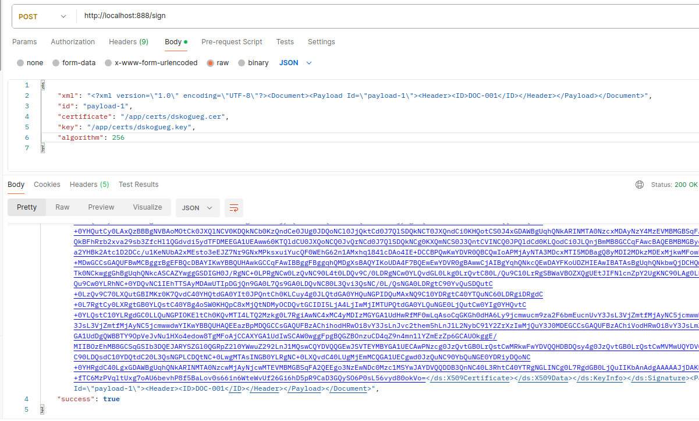
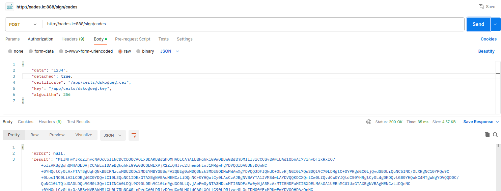

# GOST Signer (XAdES / CAdES)

Подписыватель ГОСТ (Р 34.10-2012, 256 или 512 бит): **XAdES** (подпись XML) и **CAdES/CMS**
(подпись произвольных данных). Общий образ OpenSSL 1.1.1 + gost-engine.

**XAdES** - enveloped-подпись формата XAdES-BES. КриптоПро поддерживает XADES функционал в `КриптоПро JCP` и `JavaCSP` - приложение вроде бы с отдельной лицензией и библиотека для Java. В `КриптоПро CSP` XAdES нет - причины непонятны, Java я не знаю, JCP не смог развернуть в контейнере, в итоге сделал свой подписыватель.

Подпись `<ds:Signature>` вставляется в исходный документ рядом с подписываемым элементом (или первым потомком корня, если подписывается корень). Подписываемый элемент ищется по любому атрибуту с локальным именем `Id` (`wsu:Id`, `ns1:Id` или обычный `Id`).

Размер выходного значения (в битах, длина хэша) ГОСТ задаётся полем `algorithm`: `256` (по умолчанию), `512` или `auto` (определить по ключу).

## Команды (из корня репозитория)

| Команда                                              | Действие                                       |
|------------------------------------------------------|------------------------------------------------|
| `make sig-start`                                     | Собрать образ и поднять сервис (API на `:888`) |
| `make sig-up` / `make sig-down` / `make sig-restart` | Поднять / остановить / перезапустить           |
| `make sig-build`                                     | Только собрать образ                           |
| `make sig-logs`                                      | Логи сервиса                                   |
| `make sig-check`                                     | Проверить окружение                            |
| `make sig-health`                                    | Пинг API `/health`                             |
| `make sig-bash`                                      | Shell внутри контейнера                        |

### Сборка контейнера

Первоначальная сборка может занять несколько минут (OpenSSL 1.1.1g + GOST engine).

Проверяем окружение:

```bash
docker compose run --rm signer check
```

Должен показать:

```
===========================================
Проверка окружения
===========================================
Python версия:
Python 3.9.2

OpenSSL версия:
OpenSSL 1.1.1g  21 Apr 2020

GOST engine:
(gost) Reference implementation of GOST engine

Python пакеты:
...
flask              3.1.3
lxml               6.1.1

Скрипты:
<листинг>

Сертификаты:
<листинг>

XML файлы:
<листинг>
```

---

## Подписание XML


### Вариант 1: Через bash

```bash
docker compose run --rm signer sign-xades input.xml cert.cer private.key payload-1
```

- **input.xml** - файл XML - пример для подписания в ./data/xml
- **cert.cer** - сертификат, выгруженный из ГОСТ-контейнера КриптоПро в ./data/certs
- **private.key** - закрытый ключ, выгруженный из ГОСТ-контейнера КриптоПро в ./data/certs
- **payload-1** - id тэга, который подписываем в файле-примере

Если все корректно (все файлы есть, есть блок для подписи, ключ-сертификат корректные), то готовый подписанный файл появится в ./data/xml. Он вполне валиден для отправки во внешние системы (отправляем как есть - любые изменения после подписания ожидаемо сделают подписанный пакет невалидным).

### Вариант 2: Через внутренний формат, работаем со строками + JSON

Flask API для подписи XML документов с использованием ГОСТ алгоритмов.

API Endpoints:

### `GET /health`
Проверка работоспособности сервиса.

**Response:**
```json
{
  "success": true,
  "status": "ok"
}
```

### `POST /sign/xades`
Подпись XML документа.

**Request Body (JSON):**
```json
{
  "xml": "<Envelope>...<Payload Id=\"element-id-here\">...</Payload></Envelope>",
  "id": "element-id-here",
  "certificate": "/app/certs/cert.cer",
  "key": "/app/certs/key.key",
  "algorithm": 256
}
```
`certificate` и `key` опциональны (по умолчанию `certificate.cer` / `private.key`).
`algorithm` опционально: `256` (по умолчанию), `512` или `"auto"`.



**Response (success):**
```json
{
  "success": true,
  "result": "<ns2:tag>...[подписанный XML]...</ns2:tag>",
  "error": null
}
```

**Response (error):**
```json
{
  "success": false,
  "result": null,
  "error": "Описание ошибки"
}
```

Возможные коды ошибок HTTP:
- `400` - ошибка в запросе (нет обязательных параметров, файлы не найдены)
- `500` - внутренняя ошибка при подписи

---

## CAdES-BES подпись

Подпись произвольных данных в формате **CAdES-BES** (CMS SignedData / PKCS#7) алгоритмом
ГОСТ. Прикреплённая (контент внутри подписи) или откреплённая.

Подписанные атрибуты: `contentType`, `messageDigest`, `signingTime` и **`signingCertificateV2`**
(ESS, RFC 5035 — привязка сертификата, обязателен для CAdES-BES). OpenSSL 1.1.1 этот атрибут
не добавляет (флаг `-cades` есть только в 3.0), поэтому CMS собирается через `asn1crypto`, а
ГОСТ-хэш/подпись считаются через openssl + gost-engine.

### CLI

```bash
docker compose run --rm signer sign-cades doc.pdf cert.cer private.key            # прикреплённая
docker compose run --rm signer sign-cades doc.pdf cert.cer private.key detached   # откреплённая
# -> ./data/xml/doc.pdf.p7s  (CMS в DER)
```

Файл данных кладётся в `./data/xml`, ключи — в `./data/certs`. Размер ГОСТ определяется по ключу.

### `POST /sign/cades`

```json
{
  "data": "строка-контент",
  "certificate": "/app/certs/cert.cer",
  "key": "/app/certs/key.key",
  "algorithm": "auto",
  "detached": false
}
```



Для бинарных данных вместо `data` передавайте `data_b64` (Base64). Ответ:
```json
{ "success": true, "result": "<base64 CMS SignedData в DER>", "error": null }
```

Проверка подписи:
```bash
# прикреплённая:
openssl cms -verify -noverify -inform DER -in doc.pdf.p7s
# откреплённая (-binary, чтобы openssl не канонизировал контент):
openssl cms -verify -noverify -binary -inform DER -in doc.pdf.p7s -content doc.pdf
```

## Безопасность

- API не имеет аутентификации - использовать только внутри приватной сети или локально
- Храните приватные ключи в безопасности